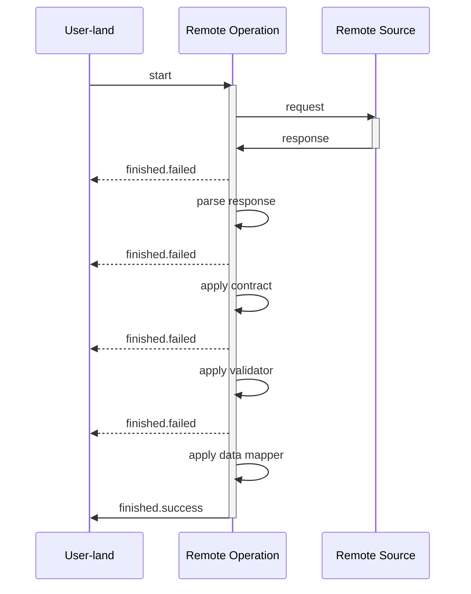

# Data flow in Remote Operation

Farfetched is designed to deal with data on the remote source (e.g. backend server), so there is an abstraction to represent an operation on this data — _Remote Operation_. For now there are two types of Remote Operations: [_Query_](/api/primitives/query) and [_Mutation_](/api/primitives/mutation).

Because Farfetched [considers data on the remote source as untrusted](/statements/never_trust), it is required to pass any response through a couple stages of validation and transformation before it is used in the application.

:::details Flow of for any _Remote Operation_

:::

## Basic and specific factories

There are two types of factories for _Remote Operations_: **basic** and **specific**. **Basic** factories are used to create _Remote Operations_ with a more control of data-flow in user-land, while **specific** factories are used to create _Remote Operations_ with a more control of data-flow in the library.

::: tip
Data-flow control is a boring and complex task, so it is recommended to use **specific** factories in many cases to delegate this task to the library.
:::

### Basic factories

- [`createQuery`](/api/factories/create_query)
- [`createMutation`](/api/factories/create_mutation)

### Specific factories

- [`createJsonQuery`](/api/factories/create_json_query)
- [`createJsonMutation`](/api/factories/create_json_mutation)

## Request-response cycle

The first step is to send a request to the remote source and wait for a response. The response is then passed to the next stage.

**Basic factories** are designed to pass control of this stage to the user-land, so `handler` (or `effect`) property of their configuration object is used to perform the request-response cycle.

**Specific factories** handle this stage internally, so user-land code have to describe only the desired result of this stage and the library will perform the request-response cycle internally in the most optimal way.

## Response parsing

This stage could be performed by internal Farfetched parsers. E.g. [`createJsonQuery`](/api/factories/create_json_query) and [`createJsonMutation`](/api/factories/create_json_mutation) use `JSON.parse` to parse the response and throw an error if the response is not a valid JSON.

However, **basic factories** do not perform any parsing. This is because the response could be in any format, and it is up to the user to decide how to parse it. It's a responsibility of the user to perform parsing inside `handler` (or `effect`) in these cases.

::: details A space for optimization

Because **specific factories** handle this stage internally, they can optimize the request-response cycle in the most optimal way.

For example, if some when in the future `JSON.parse` will be considered as a bottleneck, the library can replace it with a more optimal implementation without breaking the API. Your application would not be affected by this change, because it does not know anything about the implementation details of the library.

:::

## Contract application

Because of the [no trust](/statements/never_trust) principle, Farfetched requires to apply a [_Contract_](/api/primitives/contract) to the response before it can be used in the application.

## Validation

This is optional stage. It is performed by [_Validator_](/api/primitives/validator) and is used to check if the response is valid. If the response is not valid, it throws an error.

## Data mapping

This is optional stage.

## Error handling

If any of the stages fails, the _Remote Operation_ is considered failed, [_Event_](https://effector.dev/docs/api/effector/event) `.finished.failed` is triggered, and the error is passed to the event payload.

## Summary
