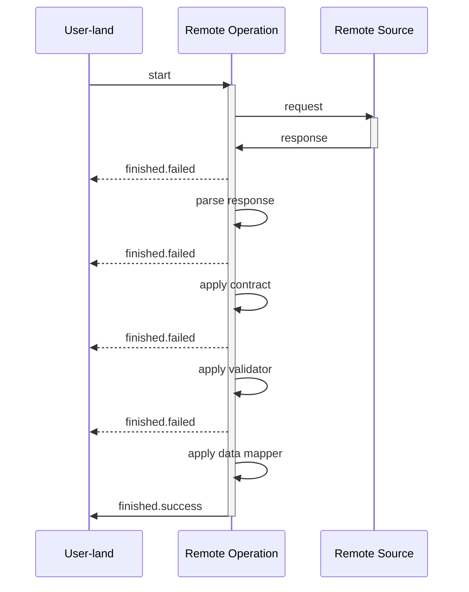

# Data flow in Remote Operation

Farfetched is designed to deal with data on the remote source (e.g. backend server), so there is an abstraction to represent an operation on this data — _Remote Operation_. For now there are two types of Remote Operations: [_Query_](/api/primitives/query) and [_Mutation_](/api/primitives/mutation).

Because Farfetched [considers data on the remote source as untrusted](/statements/never_trust), it is required to pass any response through a couple stages of validation and transformation before it is used in the application.

:::details Flow of for any _Remote Operation_



:::

## Basic and specific factories

There are two types of factories for _Remote Operations_: **basic** and **specific**. **Basic** factories are used to create _Remote Operations_ with a more control of data-flow in user-land, while **specific** factories are used to create _Remote Operations_ with a more control of data-flow in the library.

### Basic factories

- [`createQuery`](/api/factories/create_query)
- [`createMutation`](/api/factories/create_mutation)

### Specific factories

::: tip
Data-flow control is a boring and complex task, so it is recommended to use **specific** factories in many cases to delegate this task to the library.
:::

- [`createJsonQuery`](/api/factories/create_json_query)
- [`createJsonMutation`](/api/factories/create_json_mutation)

## Data-flow in specific factories

Since only **specific** factories are allows Farfetched to have a full control of data-flow, in the following articles we will take a closer look to them. **Basic** factories work in the same way, but they require more attention from the user.

### Request-response cycle

The first step is to send a request to the remote source and wait for a response. Because of Farfetched handles this stage internally, user-land code have to describe only the desired result of this stage and the library will perform the request-response cycle internally in the most optimal way.

Failed response stops the data-flow and returns control to the user-land code through `.finished.failed` [_Event_](https://effector.dev/docs/api/effector/event). Successful response continues the data-flow and passes control to the next step — response parsing.

### Response parsing

This stage could be performed by internal Farfetched parsers. In case of parsing error, the data-flow stops and returns control to the user-land code through `.finished.failed` [_Event_](https://effector.dev/docs/api/effector/event). Otherwise, the data-flow continues and passes control to the next step — contract application.

::: details JSON example

[`createJsonQuery`](/api/factories/create_json_query) and [`createJsonMutation`](/api/factories/create_json_mutation) use `JSON.parse` to parse the response and throw an error if the response is not a valid JSON. Because these factories handle this stage internally, they can optimize the parsing process in the most optimal way.

For example, if some when in the future `JSON.parse` will be considered as a bottleneck, the library can replace it with a more optimal implementation without breaking the API. Your application would not be affected by this change, because it does not know anything about the implementation details of the library.

:::

### Contract application

**Specific factories** require explicit [_Contract_](/api/primitives/contract) because they [consider the response as `unknown` by default](/statements/never_trust). So, the user-land code have to describe the contract of the response or explicitly use `unkownContarct` to preserve the `unknown` type.

If parsed data does not satisfy the [_Contract_](/api/primitives/contract), the data-flow stops and returns control to the user-land code through `.finished.failed` [_Event_](https://effector.dev/docs/api/effector/event) with an error-message that is returned from the [_Contract_](/api/primitives/contract). Otherwise, the data-flow continues and passes control to the next step — validation.

### Validation

This is optional stage. It is performed by [_Validator_](/api/primitives/validator) and is used to check if the response is valid. If the response is not valid, the data-flow stops and returns control to the user-land code through `.finished.failed` [_Event_](https://effector.dev/docs/api/effector/event) with an error-message that is returned from the [_Validator_](/api/primitives/validator). Otherwise, the data-flow continues and passes control to the next step — data mapping.

Since [_Validator_](/api/primitives/validator) is a [_Sourced_](/api/primitives/sourced), it's possible to add some extra data from the application to the validation process. For example, it could be a user's session token:

```ts
const $session = createStore<{ userId: string } | null>(null);

const userQuery = createJsonQuery({
  //...
  response: {
    validate: {
      source: $session,
      fn: (result, _params, sessionToken) => result.userId !== session.userId,
    },
  },
});
```

### Data mapping

This is optional stage. So, you can define a mapper to transform the response to the desired format.

::: warning
Data mappers have to be pure function, so they are not allowed to throw an error. If the mapper throws an error, the data-flow stops immediately without any error handling.
:::

Since mapper is a [_Sourced_](/api/primitives/sourced), it's possible to add some extra data from the application to the mapping process. For example, it could be a current language:

```ts
const $language = createStore<string>('EN');

const userQuery = createJsonQuery({
  //...
  response: {
    mapData: {
      source: $language,
      fn: (result, _params, language) => ({
        ...result,
        name: result.name.translations[language],
      }),
    },
  },
});
```

## Data-flow in basic factories

**Basic factories** are used to create _Remote Operations_ with a more control of data-flow in user-land. In this case, the user-land code have to describe **request-response cycle** and **response parsing** stages. Other stages could be handled by the library, but it is not required for **basic factories**.

## Summary

In this article, we have learned how data-flow works under the hood in _Remote operations_. We have also learned about two types of factories and how they differ from each other. Key points:

- **Basic factories** are used to create _Remote Operations_ with a more control of data-flow in user-land.
- **Specific factories** are used to create _Remote Operations_ with a more control of data-flow in the library.
- Prefer **specific factories** in many cases to delegate data-flow control to the library.
