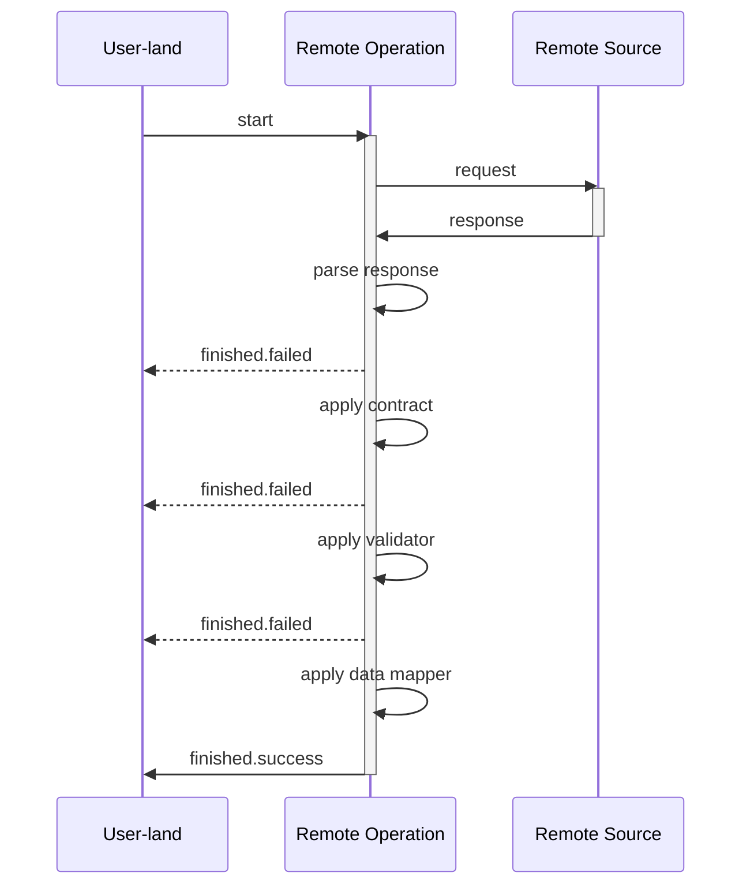

# Data flow in Remote Operation

Farfetched is designed to deal with data on the remote source (e.g. backend server), so there is an abstraction to represent an operation on this data — _Remote Operation_. For now there are two types of Remote Operations: [_Query_](/api/primitives/query) and [_Mutation_](/api/primitives/mutation).

Because Farfetched [considers data on the remote source as untrusted](/statements/never_trust), it is required to pass any response through a couple stages of validation and transformation before it is used in the application.

:::details Flow of for any _Remote Operation_

:::

## Request-response cycle

The first step is to send a request to the remote source and wait for a response. The response is then passed to the next stage.

## Response parsing

This stage could be performed by internal Farfetched parsers. E.g. [`createJsonQuery`](/api/factories/create_json_query) and [`createJsonMutation`](/api/factories/create_json_mutation) use `JSON.parse` to parse the response and throw an error if the response is not a valid JSON.

However, basic factories like [`createQuery`](/api/factories/create_query) and [`createMutation`](/api/factories/create_mutation) do not perform any parsing. This is because the response could be in any format, and it is up to the user to decide how to parse it. It's a responsibility of the user to perform parsing inside `handler` function in these cases.

## Contract application

Because of the [no trust](/statements/never_trust) principle, Farfetched requires to apply a [_Contract_](/api/primitives/contract) to the response before it can be used in the application.

## Validation

This is optional stage. It is performed by [_Validator_](/api/primitives/validator) and is used to check if the response is valid. If the response is not valid, it throws an error.

## Data mapping

This is optional stage.

## Error handling

If any of the stages fails, the _Remote Operation_ is considered failed, [_Event_](https://effector.dev/docs/api/effector/event) `.finished.failed` is triggered, and the error is passed to the event payload.

## Summary
