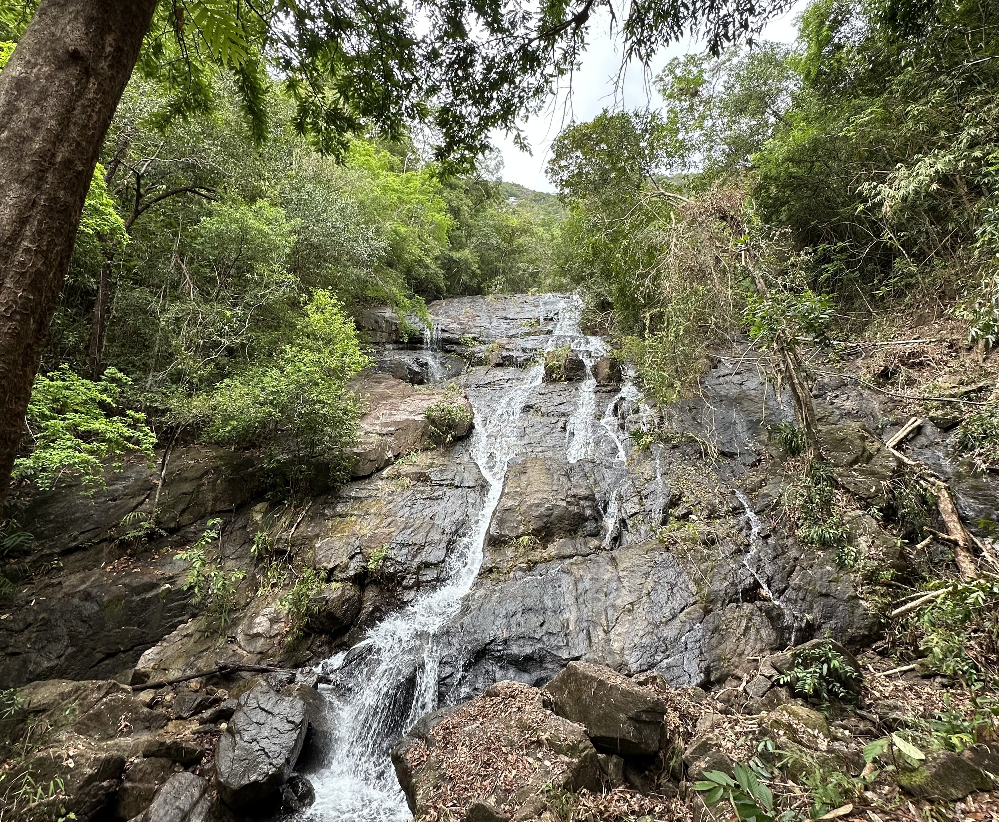

# v0.11 Namtok Ngao

> Photo by <a href="https://instagram.com/destroooooya">Maria Goroshko</a>

::: details Why Namtok Ngao?
Namtok Ngao is a national park in the Ranogn province of Thailand. This release is about [Barrier API](/tutorial/barrier_api) and Ranong is a border town near Myanmar, so it is a perfect match 🏝
:::

Two highlights of this release are:

- [Barrier API](/tutorial/barrier_api) which allows you to postpone the execution of a [_Query_](/api/primitives/query) or [_Mutation_](/api/primitives/mutation) until a certain condition is met.
- [Effector v23](https://changelog.effector.dev/#effector-23-0-0-spacewatch) with a bunch of new features and improvements.

## Migration guide

This release contains a couple of breaking changes, so please read the migration guide carefully.

### Use Effector v23

To use Farfetched v0.11 you need to use Effector v23 and have all related dependencies (`effector-solid`, `effector-vue`, etc.) updated. Please, refer to [Effector v23 migration guide for more details](https://effector.dev/en/guides/migration-guide-v23/).

### Delete `isAbortError`

Since [v0.10](/releases/0-10) aborted [_Queries_](/api/primitives/query) and [_Mutations_](/api/primitives/mutation) are not treated as failed anymore. So, `isAbortError` is not needed anymore and can be safely removed from your codebase.

<!--@include: ./0-11.changelog.md-->
