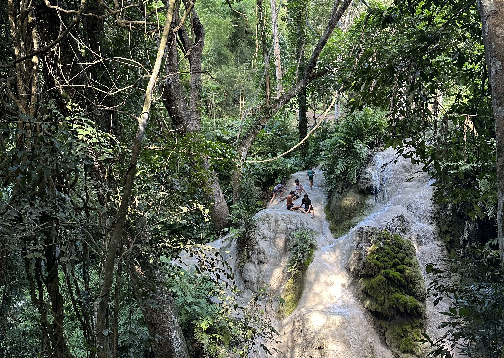

# v0.7 Nam Phu Chet Si



> Photo by <a href="https://instagram.com/destroooooya">Maria Goroshko</a>

::: details Why Nam Phu Chet Si?
Nam Phu Chet Si is a national park in the North of Thailand with a lot of great waterfalls. Numerous ideas for Farfetched came to my mind while I was there 🌊
:::

New integrations for creating [_Contract_](/api/primitives/contract) — [`@farfetched/io-ts`](/api/contracts/io-ts) and [`@farfetched/superstruct`](/api/contracts/superstruct). Also, this release contains some bug fixes, improvements and minor breaking changes.

## Migration guide

### Provide `unset` method in custom `cache` adapter

Since [v0.6.2](/releases/0-6.html#_0-6-2) Farfetched supports `unset` method in custom `cache` adapter. In v0.7 it is required.

### Do not use `refetch` in `@farfetched/solid`

```tsx
import { createQueryResource } from '@farfetched/solid';

function User() {
  const [
    user,
    {
      refetch, // [!code --]
      start, // [!code ++]
    },
  ] = createQueryResource(userQuery);

  return (
    <div>
      <button onClick={refetch}>Start query</button>
    </div>
  );
}
```

<!--@include: ./0-7.changelog.md-->
