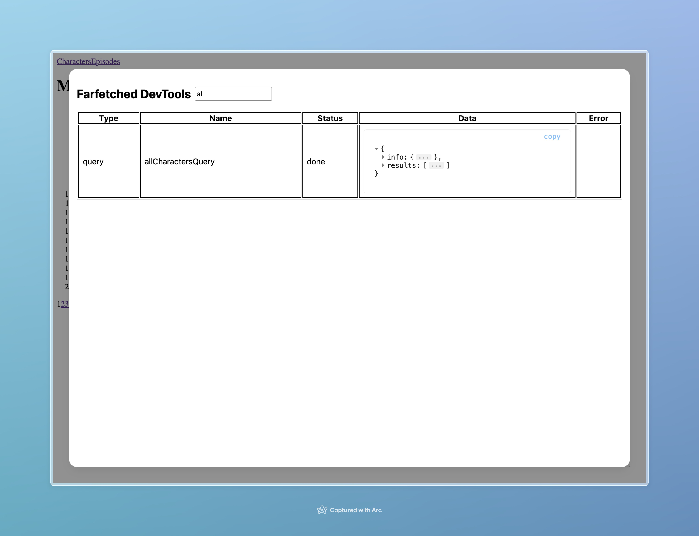

# Farfetched Dev Tools

::: warning

Currently, Farfetched Dev Tools is in technical preview, so it could have some bugs and lack of features. We are constantly working on it and will be happy to hear your feedback in [issues](https://github.com/igorkamyshev/farfetched/issues).
:::

To simplify debugging of your application, Farfetched provides a special tool — Farfetched Dev Tools. It is a browser application that allows you to see all [_Queries_](/api/primitives/query) and its states.



Farfetched Dev Tools is distributed as a separate package, so you need to install it first:

::: code-group

```sh [pnpm]
pnpm install @farfetched/dev-tools
```

```sh [yarn]
yarn add @farfetched/dev-tools
```

```sh [npm]
npm install @farfetched/dev-tools
```

:::

Then just add it to your project:

```ts
// main.ts

if (process.env.NODE_ENV === 'development') {
  const { attachFarfetchedDevTools } = await import('@farfetched/dev-tools');

  attachFarfetchedDevTools();
}
```

In case you are using Fork API, you need to pass [_Scope_](https://effector.dev/en/api/effector/scope/) to `attachFarfetchedDevTools`:

```ts
// main.ts
import { fork } from 'effector';

const scope = fork();

if (process.env.NODE_ENV === 'development') {
  const { attachFarfetchedDevTools } = await import('@farfetched/dev-tools');

  attachFarfetchedDevTools({ scope }); // [!code focus]
}
```

That is it, now you can open Farfetched Dev Tools in your browser and see all your [_Queries_](/api/primitives/query) and its states.

## Roadmap

::: tip
You can submit a feature request in [issues](https://github.com/igorkamyshev/farfetched/issues).
:::

Since Farfetched Dev Tools is quite new, it has a lot of features to be implemented. Here is a list of the planned features:

- Sorting and filtering of [_Queries_](/api/primitives/query) with more convenient UI
- Displaying [_Mutations_](/api/primitives/mutation) and [_Barriers_](/api/primitives/barrier)
- Displaying modifiers (like `retry`, `cache` or `timeout`) applied to [_Queries_](/api/primitives/query) and [_Mutations_](/api/primitives/mutation)
- Interactive map of [_Queries_](/api/primitives/query), [_Mutations_](/api/primitives/mutation) and [_Barriers_](/api/primitives/barrier) based on `connectQuery`, `update` and `applyBarrier` operators
- Ability to force start [_Queries_](/api/primitives/query) and [_Mutations_](/api/primitives/mutation), to deactivate and activate [_Barriers_](/api/primitives/barrier)
